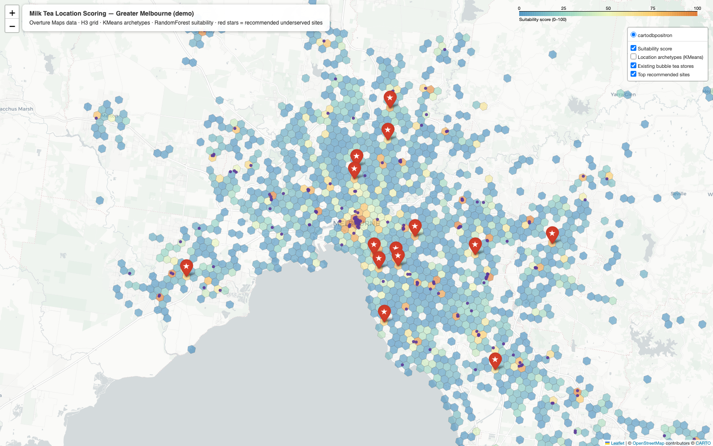

# Milk Tea Location Scoring Engine — Demo (Melbourne + Sydney)

A working proof-of-concept for a Python location scoring engine that evaluates
the commercial potential of any suburb or site for milk tea store expansion.
Built entirely on **free public data** (Overture Maps / OpenStreetMap-derived),
so it runs anywhere in Australia — or the world — with a one-line bounding-box
change (`src/cities.py` currently defines Greater Melbourne and Greater
Sydney).



## What it does

1. **Data** — pulls ~31,000 points of interest per city plus suburb
   boundaries straight from the Overture Maps public S3 bucket with DuckDB
   (no API keys, no scraping): existing bubble tea stores, cafés,
   restaurants, Asian dining, retail anchors, supermarkets, train stations,
   universities, gyms, cinemas, hotels.
2. **Geospatial features** — aggregates everything onto an H3 hexagonal grid
   (~0.74 km² cells): in-cell counts, walkable-catchment counts (cell +
   neighbours), and distance to the CBD. 1,512 active cells in Melbourne,
   1,318 in Sydney.
3. **KMeans archetypes** — clusters every cell into interpretable location
   types: *CBD & Major Activity Centres, High-Street / Café Strip, Middle-Ring
   Mixed Use, Local Neighbourhood Centre, Quiet Residential*.
4. **RandomForest suitability score** — a revealed-demand model: the forest
   learns what separates locations that already sustain a bubble tea store
   (208 real stores in Melbourne, 288 in Sydney) from those that don't, using
   only demand-side features. Every cell is scored **out-of-fold** (5-fold
   CV), so no cell is scored by a model that saw it in training.
   **ROC-AUC 0.88 (Melbourne) / 0.87 (Sydney)**.
5. **Opportunity ranking** — suitability discounted by existing nearby supply
   surfaces *underserved whitespace*: cells the model says should support a
   store but where none exists yet.

## Outputs

| File | What it is |
|---|---|
| `docs/index.html` | Landing page linking both city demos |
| `docs/<city>_milk_tea_map.html` | Interactive map — score choropleth, archetype layer, every competitor store, top-15 recommended sites with reasons |
| `docs/<city>_top_locations.csv` | Ranked shortlist with scores, archetype, feature breakdown and named anchors (shopping centres, stations) |
| `docs/<city>_milk_tea_map.png` | Static snapshot of the map |

Top of the current shortlists — Melbourne: Thomastown, Windsor, Hawthorn
East, Armadale, Caulfield North, Coburg, Brunswick. Sydney: Neutral Bay,
Camden, Lane Cove, Baulkham Hills, Cronulla, Manly. Each is tagged with its
archetype and the named anchors (shopping centres, stations) that drive the
score.

## What the model learned

In Melbourne, retail anchor density is the strongest single predictor,
followed by restaurant and **Asian dining density**; in Sydney, Asian dining
density ranks first — a well-known leading indicator for bubble tea demand.
Both match retail-site intuition, which is exactly what you want from a v1
model.

## Run it

```bash
python -m venv .venv && source .venv/bin/activate
pip install -r requirements.txt
python -m src.fetch_data melbourne   # ~1 min: pulls fresh Overture data from S3
python run_demo.py melbourne         # features → model → map + CSV
python -m src.fetch_data sydney && python run_demo.py sydney
```

## From demo to production

This demo deliberately stays small. The full engine would add:

- **ABS Census / SEIFA integration** — population, age mix, income, cultural
  background per SA1/SA2 (young + culturally diverse areas over-index for
  milk tea).
- **Foot traffic proxies** — GTFS patronage, pedestrian counters, Google
  Popular Times.
- **Rent & vacancy data** to turn "demand score" into "ROI score".
- **Address-level API** — score any address or candidate lease, not just grid
  cells (`score(address) -> {score, drivers, comparables}`).
- **Regression on store performance** — once the client shares per-store
  revenue, the same pipeline retrains from "can a store survive here" to
  "how much will it sell here".
- Brisbane / Perth / national rollout: one new entry in `src/cities.py`.

## Stack

Python · DuckDB (spatial + httpfs) · Overture Maps · H3 · scikit-learn
(KMeans, RandomForestClassifier) · shapely · folium
